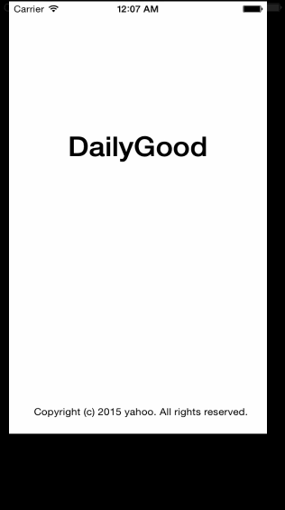

# DailyGood

Wireframes for an app designed to suggest local opportunities for volunteering and track a person's good score. Ultimately it will be based on data from the [All for Good API](http://www.allforgood.org/use-our-api). 

Time spent: about 10 hours.

Completed user stories:

 * [x] Required: User can view a list of latest box office movies including title, cast and tomatoes rating
 * [x] Required: User can click on a movie in the list to bring up a details page with additional information such as synopsis
 * [x] Optional: Placeholder image is used for movie posters loaded in from the network

Notes:

* Got stuck initially due to problems with images -- was using jpeg and too large images. 

* Used Navigation and Tab Bar controllers since we just covered them in class.

* Spent some time trying to display a static table, could not figure it out.

* App crashes when clicking on Search Bar controller, probably because of missing code to handle it.

Walkthrough of user stories:

GIF created with [LiceCap](http://www.cockos.com/licecap/)
