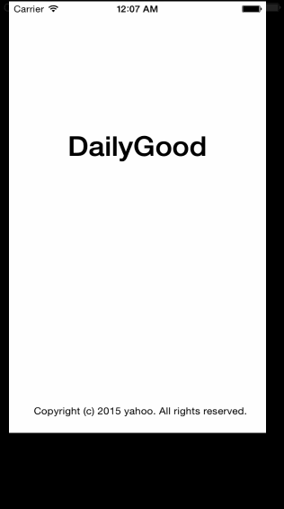

# DailyGood

Prototype of app designed to suggest local opportunities for volunteering and track a person's good score. Ultimately it will be based on data from the [All for Good API](http://www.allforgood.org/use-our-api). 

 * [x] User can view a list of local opportunities for volunteering. Each is represented by a card with name and an image of the charity organization and summary time information. Tapping on a card leads to a detail view. From here the user can see more about the charity, view and enter ratings, comments pictures, and share with friends. Or the user can proceed to a view with list of times. Here the user can pick a time and commit to volunteer. Can also invite friends.
 * [x] User can go to a screen to track his/her "social good score". From here there are buttons leading to screens with various functions: see more detailed statistics of past volunteer work (also shareable with friends), view or modify the profile of values (categories of volunteer work), edit demographic info (profession and optionally salary range, used to convert volunteer hours into monetary value), connect to friends via social media (also used to login initially), and see history of volunteer activities.
 * [x] A third screen will leads to more functions to rate the app or read terms of service, privacy policy, and credits. 

Walkthroughs of user stories (wireframes):

GIF created with [LiceCap](http://www.cockos.com/licecap/)
